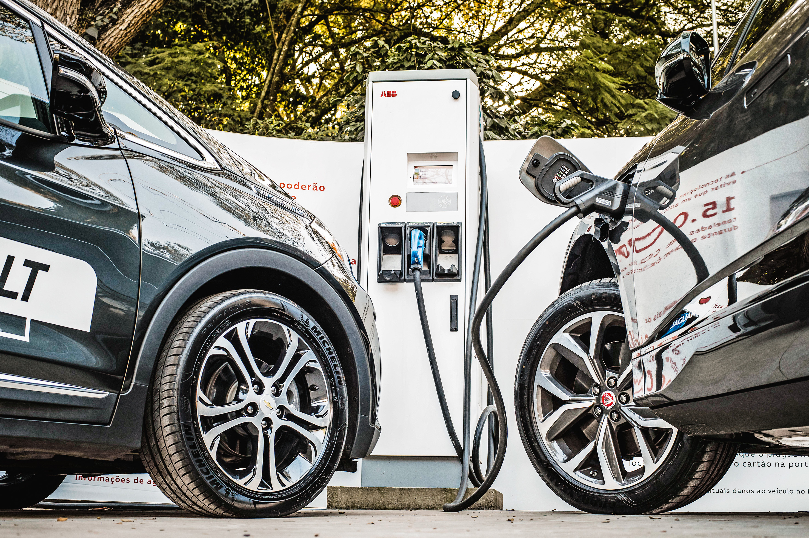

**A Ascensão dos Carros Elétricos em Portugal: Desvendando Mitos e Realidades**

A presença de carros elétricos nas estradas portuguesas tem crescido notavelmente, representando cerca de 20% das vendas iniciais de automóveis em 2022, com uma projeção de atingir meio milhão até 2035. Esses veículos operam com motores elétricos alimentados por baterias recarregáveis, oferecendo autonomia variável, com modelos populares cobrindo entre 300 e 400 km por carga.

Além dos benefícios ambientais, carros elétricos proporcionam vantagens econômicas substanciais. A manutenção é mais acessível, pois não requer óleos de motor, filtros ou correias, resultando em intervalos de revisão mais espaçados, a cada 50 mil quilômetros. Em média, as emissões de dióxido de carbono são 66% menores do que carros a gasolina e diesel, podendo chegar a 70-80% em Portugal.

A infraestrutura de carregamento tem se expandido, com a rede MOBI.E abrangendo mais de 4000 postos em Portugal, oferecendo diversas opções de carregamento, desde horas em carregadores convencionais até minutos em carregadores ultrarrápidos. Os custos variam, mas carregar em casa geralmente é mais econômico, embora os carregadores públicos também apresentem opções competitivas.

Para lidar com situações de emergência, postos de carregamento estão sendo instalados em autoestradas e estações de serviço, garantindo que mesmo uma parada de 15 minutos seja suficiente para retomar a viagem. O país continua a investir na expansão dessa infraestrutura, promovendo a adoção de carros elétricos como uma opção prática e sustentável para os consumidores portugueses.

Assim, os carros elétricos estão se tornando uma escolha cada vez mais viável em Portugal, com uma rede de suporte em crescimento e vantagens econômicas e ambientais significativas para os motoristas.

