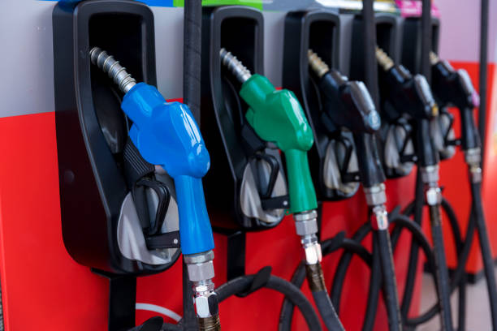

Com os preços da gasolina e do gasóleo acima dos dois euros por litro, todos estamos a fazer contas à vida. Por isso, hoje trazemos **8 dicas para poupar combustível, a começar logo que abastece!** 

<!--truncate-->

1. **A POUPANÇA COMEÇA ENQUANTO ABASTECE**
   - Abasteça de manhã ou à noite, quando a temperatura é mais baixa para obter mais combustível por litro.
   - Evite apertar demasiado a "pistola" durante o abastecimento para reduzir a passagem de vapor.

2. **APOSTE NUMA CONDUÇÃO EFICIENTE**
   - Pratique a "eco-condução" para economizar até 20% de combustível.
   - Evite travagens bruscas, arranques violentos e altas velocidades.
   - Use o "cruise control" para manter uma velocidade constante.

3. **RETIRE AS CARGAS DESNECESSÁRIAS**
   - Remova caixas de bagagem ou suportes no tejadilho quando não estiverem em uso.
   - O peso adicional no tejadilho aumenta o consumo em 5%, e o peso na mala em 1-3% por cada 50 kg.

4. **MANTENHA A PRESSÃO ADEQUADA NOS PNEUS**
   - Verifique regularmente a pressão dos pneus, pois a baixa pressão pode aumentar o consumo em 1-2%.

5. **ESCOLHA ENTRE ABRIR AS JANELAS E LIGAR O AR CONDICIONADO**
   - A alta velocidade, prefira o ar condicionado para economizar combustível.
   - Em velocidades mais baixas, abra as janelas para evitar o consumo excessivo do ar condicionado.

6. **EVITE O TRÂNSITO E CAMINHOS DE TERRA BATIDA**
   - Evite o "pára-arranca" no trânsito, pois aumenta o consumo até 38%.
   - Evite estradas de terra batida, que aumentam o consumo em 30%.

7. **TENHA CUIDADO AO ESTACIONAR**
   - Evite procurar um lugar por muito tempo para economizar combustível.
   - Minimize as manobras e prefira estacionar em espinha para economizar.

8. **FAÇA AS REVISÕES E MANUTENÇÃO PERIÓDICAS**
   - Siga as recomendações do fabricante para revisões regulares.
   - Um sistema de ignição e injeção eficiente pode reduzir o consumo em 3.5-10%.
   - Manter filtros limpos e níveis adequados de óleo e líquido de refrigeração pode economizar até 10%.

Essas práticas podem contribuir significativamente para a poupança de combustível e para a eficiência do veículo.
