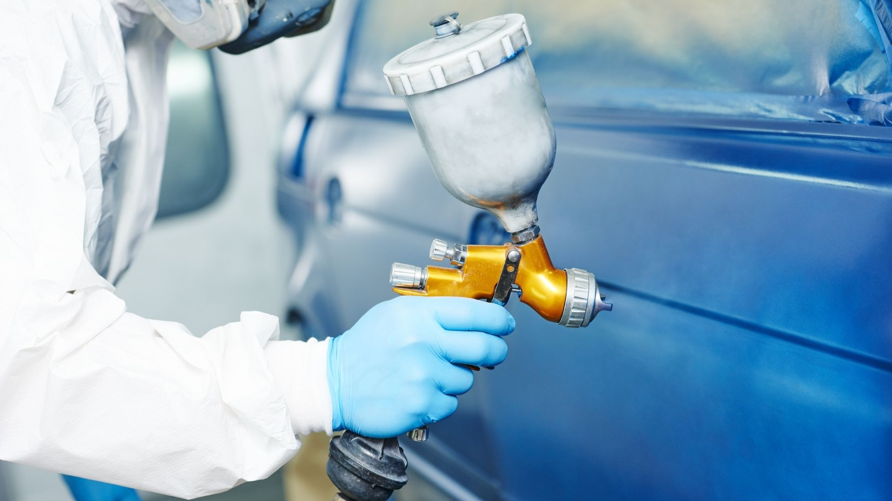
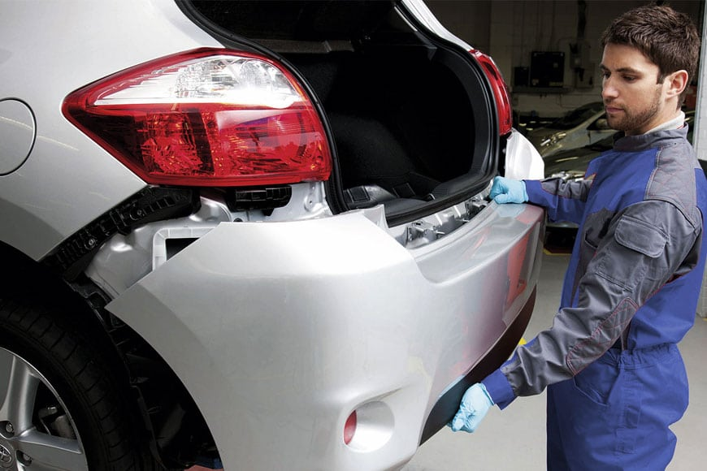

# Pinturas e Bate-chapas 

Prezamos pela excelência do nosso trabalho e pelo cumprimento de prazos e orçamentos!

## Pintura

Pintura de carroçaria efectuada com componentes de qualidade e sempre em estufa. Temos _laboratório de cores de forma a pintar qualquer viatura a qualquer cor._

A AutoMaster destaca-se pela qualidade e preços competitivos. Equipada com tecnologia de ponta, realizamos reparos em veiculos para garantir um visual perfeito. Fazemos **afinação das cores com o gabarito do Detalhe Automóvel.** 

## Bate-chapas 

### A AutoMaster devolve-lhe a **sensação de carro novo!** 

Prestamos um serviços de bate-chapas o qual nos arriscamos chamar de excepcional.  
Na AutoMaster, preocupamo-nos com o **rigor do trabalho, com o preço final para o cliente e em manter o automóvel original**. Um técnico de bate chapas experiente pode fazer autênticos _milagres_, conhecendo os pontos de fraqueza e força das chapas de metal, conseguindo muitas vezes, com poucas marteladas, orientar o painel para a sua forma original.

**_Faça já seu orçamento connosco!_**
