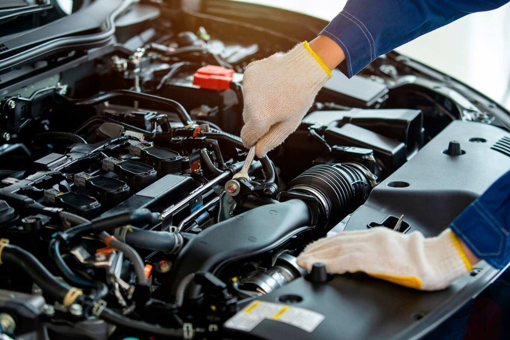

# Serviços de Revisão 

A nossa oficina conta com uma equipe _especializada e apta_ para encontrar soluções de manutenção adaptadas às suas necessidades e às do seu carro. O serviço de _Revisão AutoMaster_ tem sempre em consideração as **características do seu veículo**, nomeadamente os **dados técnicos, quilometragem, idade e tipo de utilização**.

Contamos com duas opções diferentes, mas sempre com a mesma garantia: 

## Revisão Oficial 

A AutoMaster oferece uma revisão conforme **as especificações do livro de manutenção do fabricante** e que **mantém a garantia** do mesmo em todas as marcas e modelos. (Recomendamos para veículos com até 7 anos, antes da IPO passar a ser anual)

## Revisão Clássica 

Esta opção é uma solução que respeita o seu companheiro de estrada de há varios anos. A _Revisão Clássica_ é **adaptada para cada veículo em todas as marcas e modelos, com custos ajustados à idade do mesmo**. (Recomendamos para veículos com mais de 7 anos)
